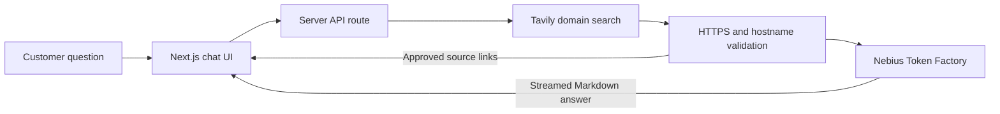

# Nebius Token Factory · Customer Support Demo

An enterprise demonstration of source-grounded customer support using:

- Nebius Token Factory with a live model catalog
- Tavily Search restricted to a user-configured approved domain
- A streamed Next.js interface with conversational follow-ups and approved-source links

This is an independent technical demonstration.

## Architecture



The API route keeps credentials out of the client bundle, carries recent session
history for follow-ups, and sends only validated source excerpts to the model.

## Run locally

The development script reads the two files requested for this workspace:

```text
~/Documents/nebius.env  → NEBIUS_API_KEY
~/Documents/tavily.env  → TAVILY_API_KEY
```

Then run:

```bash
npm install
npm run dev
```

Open `http://localhost:3000`. The credential dialog also accepts browser-tab-only
overrides and opens with `⌘K` or `Ctrl+K`.

## Grounding boundary

1. The server asks Tavily to search only the domain selected in Configuration.
2. Every result URL is parsed and checked again; only that HTTPS hostname and its
   subdomains are accepted.
3. The accepted excerpts and recent conversation context are passed to the model with
   an explicit source-only prompt.
4. The streamed Markdown response hyperlinks claims to the approved source URLs.

## Deploy on Vercel

Import the repository and set these Environment Variables for Production and Preview:

```text
NEBIUS_API_KEY
TAVILY_API_KEY
```

No other Vercel configuration is required.

## Deploy on Render

The included `render.yaml` defines a Node web service. Create a Blueprint from the
repository and enter `NEBIUS_API_KEY` and `TAVILY_API_KEY` when Render prompts for them.

For a public deployment, prefer server-side environment variables. Browser-entered keys
are intended for controlled demos and should only be used over HTTPS.
